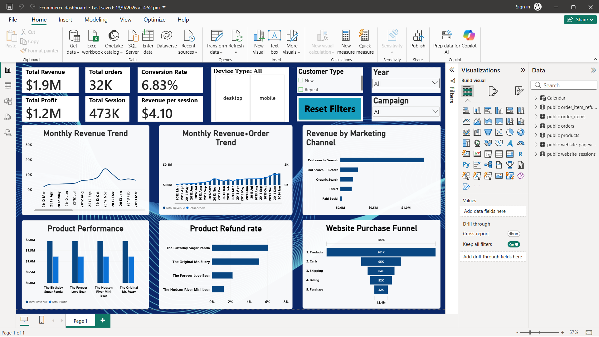

# E-Commerce Business Analytics

End-to-end E-Commerce Business Analytics project using Excel, PostgreSQL, SQL, and Power BI.

## Business Objective
Analyze website traffic, marketing performance, product profitability, refunds, and the purchase funnel to identify opportunities for improving conversion and revenue.

## Tools Used
- Microsoft Excel
- Power Query
- PostgreSQL / SQL
- Power BI
- DAX

## Dataset
The project includes:
- Website Sessions
- Orders
- Order Items
- Products
- Order Item Refunds
- Website Pageviews

## Key KPIs
- Total Sessions
- Total Orders
- Revenue
- Profit
- Profit Margin
- Conversion Rate
- Revenue per Session
- Refund Rate

## Key Insights
- Overall conversion rate was approximately 6.83%.
- Desktop conversion was around 8.24%, compared with approximately 3.06% on mobile.
- The largest funnel drop-off occurred between Products and Cart at around 64%.
- GSearch generated the highest traffic and revenue volume.
- BSearch showed a slightly higher conversion rate than GSearch.

## Business Recommendations
- Improve the mobile user experience and checkout journey.
- Optimize product pages and Add-to-Cart CTA visibility.
- Investigate the Products-to-Cart funnel drop-off.
- Evaluate marketing channels using conversion, revenue, profitability, and acquisition cost.

## Repository Contents
- `setup.sql` — SQL analysis queries
- `Screenshot.png` — Power BI dashboard preview

## Dashboard Preview

